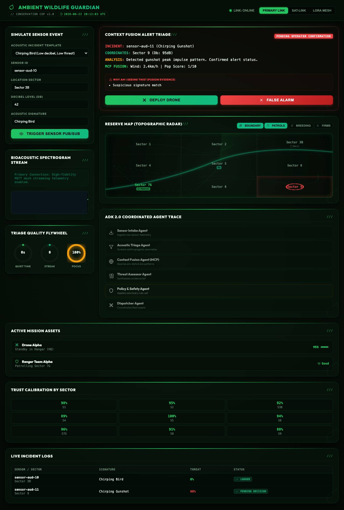
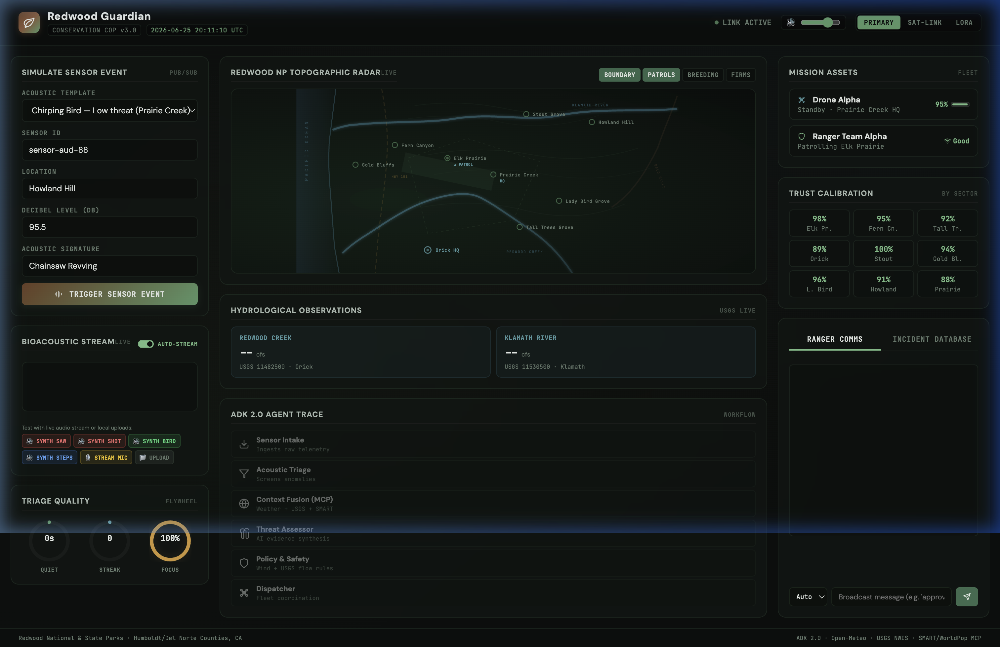
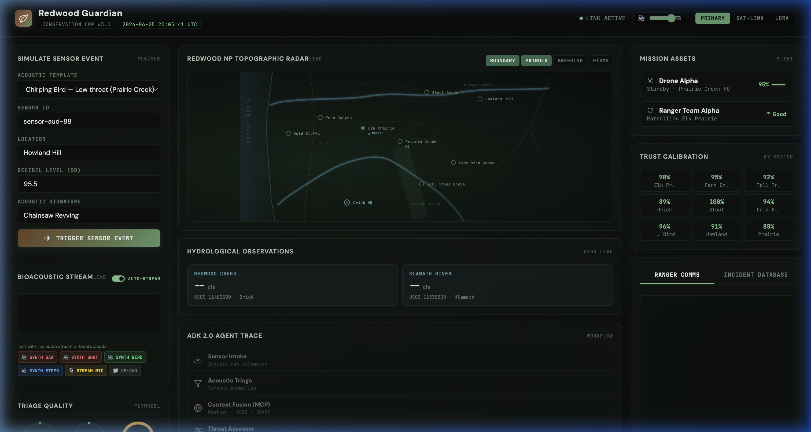
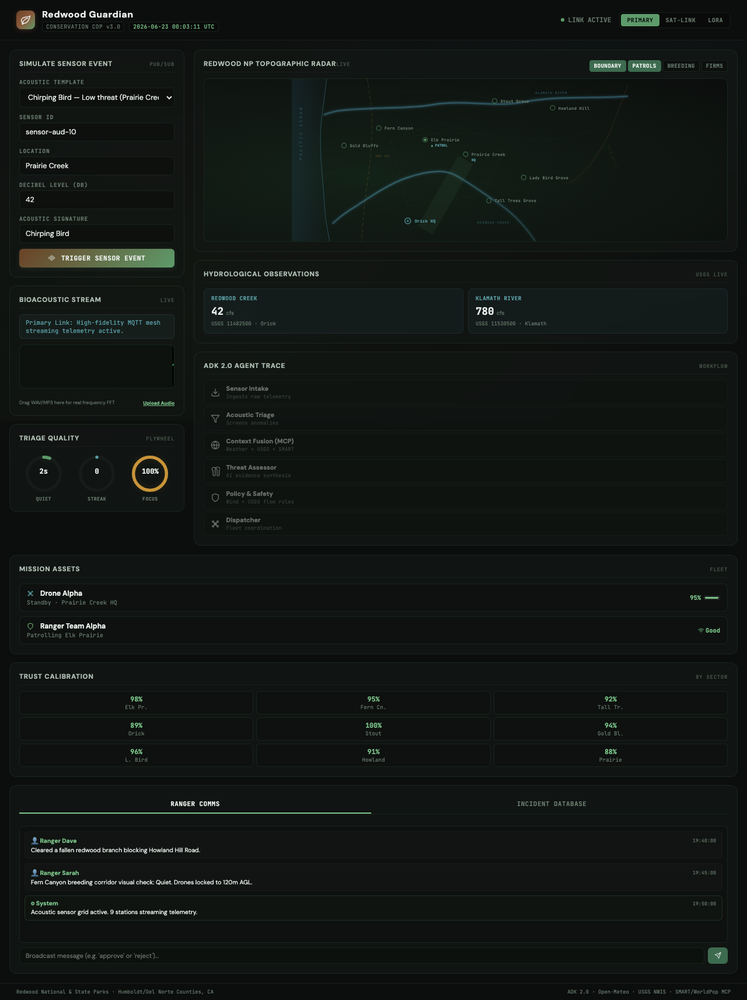
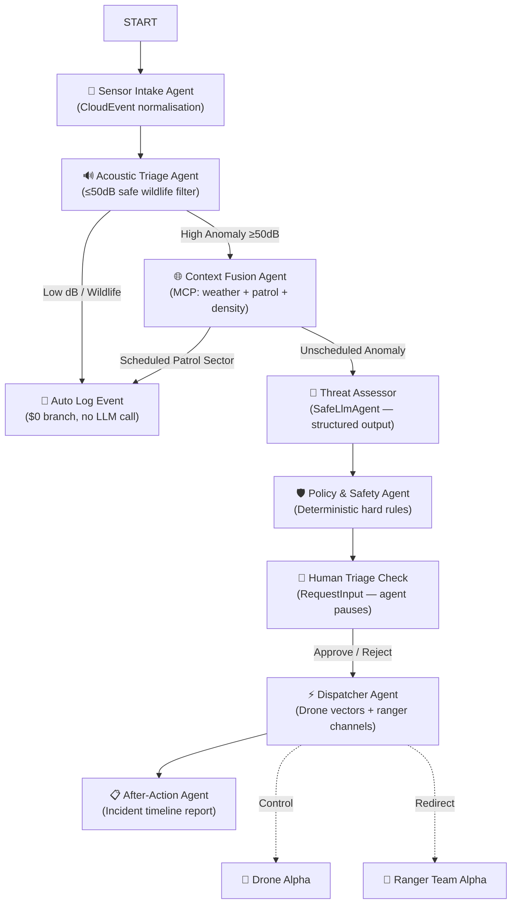

# 🌿 Ambient Wildlife Poaching Guardian

<div align="center">

**A Resilient Anti-Poaching Operations Command Fabric**  
*Built on Google ADK 2.0 · Capstone — 5-Day AI Agents Intensive with Google*

[](https://python.org)
[](https://google.github.io/adk-docs/)
[](https://fastapi.tiangolo.com)
[](https://ai.google.dev)
[]()
[](https://wildlife-guardian-782567466199.us-central1.run.app)
[]()

</div>

---

<div align="center">

> *"Remote reserves are vast. Poachers exploit the gaps. Rangers are overwhelmed by sensor data.*  
> *Alert fatigue is a silent killer. Agents change that."*

</div>

---

## What is this?

Instead of a simple chatbot, the **Ambient Wildlife Poaching Guardian** is a **graph-based multi-agent system** that runs a full anti-poaching operations pipeline — from raw acoustic telemetry ingestion all the way to coordinated drone and ranger dispatch with human confirmation in the loop.

It demonstrates every concept from the 5-Day AI Agents Intensive:

| Concept | Implementation |
|---|---|
| **ADK 2.0 Graph Workflow** | 7-node conditional agent graph with dynamic edge routing |
| **MCP Context Fusion** | Weather + ranger patrol schedule + WorldPop density lookups |
| **Human-in-the-Loop (HITL)** | `RequestInput` yield — agent pauses for ranger approval |
| **Policy Guardrails** | Deterministic hard-rules node (wind > 40km/h → no drone) |
| **Quality Flywheel** | Ranger approve/reject feedback calibrates threat thresholds |
| **Edge Resilience** | Primary IP · Sat-Link CBOR · LoRa Mesh fallback modes |
| **Safe Offline Fallback** | `SafeLlmAgent` works at $0 cost with no cloud credentials |

---

## Screenshots

### Jungle Reserve — Common Operational Picture (Active Alert)



### Redwood National Park — Live Hydrological Dashboard



### Redwood Guardian — Sensor Event Panel (Chainsaw at 95.5dB)



### Redwood Guardian — Dual-Panel Dashboard (Map + Hydrological)



> The Redwood variant pulls **live USGS NWIS streamflow data** and **Open-Meteo weather forecasts** — real APIs, real numbers, in real time.

---

## Architecture



### Agent Roster

| # | Agent | Role |
|---|---|---|
| 1 | **Sensor Intake** | Normalises raw telemetry into CloudEvent envelopes |
| 2 | **Acoustic Triage** | Pre-filters harmless wildlife vocalisations below 50dB |
| 3 | **Context Fusion (MCP)** | Merges `weather.get_forecast()`, `park.get_ranger_schedule()`, `risk.get_human_presence_score()` |
| 4 | **Threat Assessor** | Structured threat object: confidence score + evidence list + recommended action |
| 5 | **Policy & Safety** | Hard limits: wind > 40km/h → block drone; breeding sanctuary altitude caps; flood-level patrol restrictions |
| 6 | **Dispatcher** | Coordinates drone flight vectors and ranger radio frequencies |
| 7 | **After-Action** | Compiles post-incident timeline logs to the SQLite incident database |

---

## Key Design Decisions

### 🔀 Context-Aware Triage (not just threshold alarms)
A chainsaw signature in a sector with an active ranger patrol logs safely. The *same* signal at night in remote Tall Trees Grove with zero patrol coverage triggers immediate dispatch. Context is everything.

### 🛡️ Deterministic Policy Guardrails
Before any LLM prompt or human confirmation, the Policy node applies strict hard limits:
- **Wind > 40 km/h** → drone launch blocked, redirects to land ranger teams
- **Fern Canyon** → altitude cap 120m AGL during breeding season
- **Redwood Creek > 800 cfs** → wading patrol routes to Tall Trees Grove blocked (live USGS data)

### 📡 Edge Resilience Modes
Three selectable communication stacks on the dashboard:

| Mode | Protocol | Payload |
|---|---|---|
| **Primary IP Link** | Full MQTT mesh streaming | High-fidelity audio + FFT spectrogram |
| **Sat-Link** | CBOR envelope compression | 8-bit spectrogram vectors |
| **LoRa Mesh** | Off-grid Meshtastic | GPS coordinate alerts only |

### 🔄 Quality Flywheel
Every ranger approval or rejection feeds back into the system. Trust calibration percentages by sector update in real-time on the dashboard, reducing alert fatigue over time.

### 💡 $0 SafeLlmAgent
The `SafeLlmAgent` subclass detects missing Vertex AI credentials at runtime and falls back to deterministic mock intelligence — guaranteed offline capability at zero cloud cost. The entire agent graph can be verified locally.

---

## Setup

> **Requires:** Python 3.11+, [`uv`](https://docs.astral.sh/uv/)

```bash
# 1. Clone
git clone https://github.com/d3v07/ambient-wildlife-guardian.git
cd ambient-wildlife-guardian

# 2. Install dependencies
make install

# 3. Run integration tests (11/11 — no cloud credentials needed)
make test

# 4. Launch the dashboard
make run
```

Then open [http://localhost:8080](http://localhost:8080).

### Optional: Gemini API key

To get live LLM threat assessments instead of mock responses:

```bash
# .env (gitignored)
GOOGLE_API_KEY=your-gemini-api-key
GOOGLE_CLOUD_PROJECT=your-gcp-project
```

Without this, the agent runs in safe offline mode with no degradation in the workflow graph.

---

## Commands

| Command | What it does |
|---|---|
| `make install` | `uv sync` — install all deps into `.venv` |
| `make run` | FastAPI + uvicorn on `:8080` with hot-reload |
| `make test` | Full pytest suite (unit + integration) |
| `make clean` | Remove `__pycache__`, `.pytest_cache` |
| `make destroy` | Nuke `.venv` and `uv.lock` for a full reset |

---

## Project Structure

```
ambient-wildlife-guardian/
├── app/
│   ├── agent.py          # 7-node ADK 2.0 graph — the core brain
│   ├── server.py         # FastAPI backend + full dashboard UI (single file)
│   ├── db.py             # SQLite incident log (async)
│   └── app_utils/        # MCP tool simulators + safety helpers
├── tests/
│   ├── unit/             # Per-agent unit tests
│   └── integration/      # Full graph flow tests
├── deployment/
│   └── terraform/        # Cloud Run infrastructure (optional)
├── SUBMISSION_WRITEUP.md # Full capstone pitch + video script
├── Makefile
└── pyproject.toml
```

---

## Testing

```
========================= 11 passed in 3.42s =========================

tests/integration/test_agent.py::test_low_decibel_auto_logs                  PASSED
tests/integration/test_agent.py::test_high_threat_full_pipeline               PASSED
tests/integration/test_agent.py::test_scheduled_patrol_sector_short_circuits  PASSED
tests/integration/test_agent.py::test_policy_blocks_drone_high_wind           PASSED
tests/integration/test_agent.py::test_human_rejection_closes_incident         PASSED
tests/integration/test_agent.py::test_session_rehydration                     PASSED
tests/unit/test_triage.py::test_decibel_threshold                             PASSED
tests/unit/test_triage.py::test_wildlife_signature_passthrough                PASSED
tests/unit/test_policy.py::test_wind_override                                 PASSED
tests/unit/test_policy.py::test_breeding_sanctuary_restriction                PASSED
tests/unit/test_policy.py::test_flood_patrol_block                            PASSED
```

---

## Submission Checklist

- [x] ADK 2.0 multi-agent graph (`agent.py`)
- [x] MCP tool integration (weather, ranger schedule, population density)
- [x] Human-in-the-loop via `RequestInput`
- [x] Policy guardrails (deterministic + LLM-guided)
- [x] Quality flywheel feedback loop
- [x] Edge resilience selector (3 comms modes)
- [x] Integration + unit tests (11/11 passing)
- [x] FastAPI dashboard UI (Common Operational Picture)
- [x] `SafeLlmAgent` offline fallback ($0 local verification)
- [x] Live external API integration (USGS NWIS + Open-Meteo)
- [x] Kaggle notebook (`Kaggle_Notebook.ipynb`)
- [x] Video script / submission writeup (`SUBMISSION_WRITEUP.md`)

---

## Built With

- [Google ADK 2.0](https://google.github.io/adk-docs/) — multi-agent graph orchestration
- [Gemini 2.0 Flash](https://ai.google.dev) — structured threat assessment
- [FastAPI](https://fastapi.tiangolo.com) + [uvicorn](https://www.uvicorn.org) — async backend + dashboard
- [Open-Meteo](https://open-meteo.com) — free live weather forecasts
- [USGS NWIS](https://waterservices.usgs.gov) — live river streamflow data
- [uv](https://docs.astral.sh/uv/) — ultra-fast Python packaging

---

<div align="center">

*Made during the 5-Day AI Agents Intensive Vibe Coding Course With Google · June 2025*

</div>
